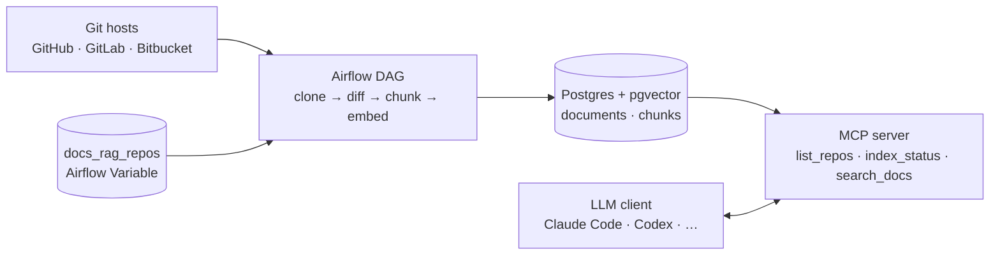

# Architecture

For schema, error handling, retries, and testing strategy see [design.md](design.md) (ingestion) and [design-mcp.md](design-mcp.md) (query side).

## Flow

## Stages

### Ingestion

**1. Read config** — `get_repos` loads the `docs_rag_repos` Variable (a JSON list of repo configs).

**2. Diff per repo** — `process_repo` is mapped one task per entry; each instance shallow-clones the repo, walks every `.md`, sha256s it, and compares against the `documents` table (the embedded baseline). Output = added / modified / deleted change records.

**3. Flatten** — `aggregate_changes` merges per-repo lists into one stream and logs per-(repo, branch) counts.

**4. Embed + write** — `embed_and_upsert` splits each upserted file into header-aware token-bounded chunks, runs every chunk through BGE-large in one batched call, and replaces the file's row + chunks in one transaction. Deletes cascade via the FK from `chunks` to `documents`.

### Query

**`list_repos`** and **`index_status`** are pure SQL aggregates over the `documents` (+ `chunks`) tables. No model load.

**`search_docs`** runs the four-stage pipeline: BGE-large embed of the query → pgvector cosine top-20 → BGE-reranker-base cross-encoder rerank → MMR diversification → top_k.

## Self-healing baseline

A `documents` row exists **only after** its chunks were committed in the same transaction. If embed_and_upsert fails mid-batch, partial files are not marked. The next run sees them as still new / modified and reprocesses automatically.

## Runtime

| Container | Image | Role |
|---|---|---|
| `postgres` | `pgvector/pgvector:pg18` | Hosts the Airflow metadata DB and the `docs_rag` app DB. Schema applied once via `/docker-entrypoint-initdb.d/`. |
| `airflow` | extends `apache/airflow:3.1.6-python3.12` | Runs `airflow standalone`. Ingestion side. BGE-large ONNX + tokenizer baked into the image at build time. |
| `mcp` | `python:3.12-slim` + `mcp_server/` | Streamable HTTP MCP server on port `8000`. Query side. BGE-large + BGE-reranker-base baked in. Bearer-auth via `RAGIT_MCP_TOKEN`. |

Compose pulls `${AIRFLOW_FERNET_KEY}`, `${POSTGRES_USER}`, `${POSTGRES_PASSWORD}`, `${POSTGRES_DB}`, `${RAGIT_MCP_TOKEN}` from `.env`. Admin login for Airflow UI lives in `docker/admin_password.json`.
